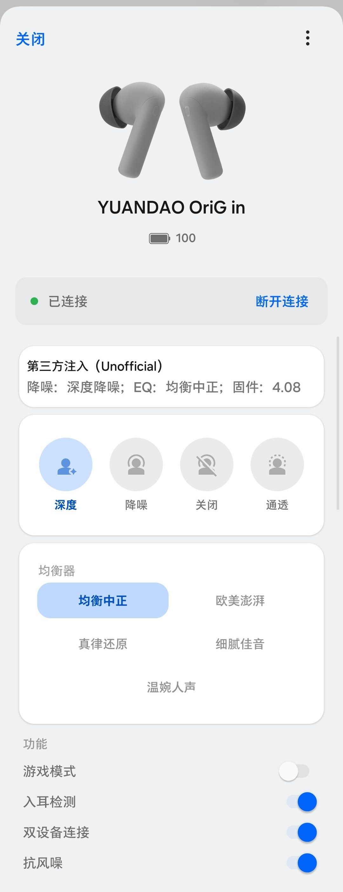

<p align="center">
  
</p>

# YUANDAO-Origin-ColorOS-Panel（YOICP）

把**第三方蓝牙耳机**（原道 / NiceHCK 等）的Orig in接入 **ColorOS「无线耳机」系统面板**的 LSPosed 模块
—— 在系统自带的耳机面板里直接提供**降噪档位、均衡器与功能开关**，并回读**真实电量与状态**。

> 基于 **LSPosed API 102（Modern API）**，未使用任何旧版 `XC_MethodHook` / `XposedHelpers`。

---

## ✨ 效果

<p align="center">
  
  <br>
  <sub>ColorOS 16 系统「无线耳机」面板实拍 —— 第三方控制区直接嵌在系统面板内</sub>
</p>

上图自上而下：**原道官方产品图**（替换了系统的通用耳机图）→ 设备名与**真实电量**
→ 已连接状态 → **实时状态摘要**（降噪档位 / EQ / 固件版本）→ **降噪 4 档**
→ **均衡器 5 项** → **功能开关**。

| 能力 | 说明 |
|---|---|
| **面板嵌入** | 控制区注入系统弹窗内部，位置随官方内容自动对齐 |
| **降噪切换** | 4 档：深度 / 降噪 / 关闭 / 通透 |
| **均衡器** | 5 项：均衡中正 / 欧美澎湃 / 真律还原 / 细腻佳音 / 温婉人声 |
| **功能开关** | 游戏模式 / 入耳检测 / 双设备连接 / 抗风噪 |
| **真实数据** | 降噪档位、EQ、固件版本实时回读（打开面板即刷新 + 每 10 分钟自动同步） |
| **设备图** | 用原道官方产品图替换系统通用耳机图 |
| **视觉** | 官方同款：浅灰面板底 + 白色圆角卡片 + 淡蓝选中态 + 主题蓝开关 |

---

## 📱 环境要求

| 项 | 要求 |
|---|---|
| **系统** | **ColorOS 16**（实测 `16.0.1.301(CN01)`）、Android 16（API 36） |
| **框架** | **LSPosed**，支持 **API 102** |
| **宿主 App**<br>（面板所在） | `com.heytap.mydevices`（设备空间 / My Devices）**16.8.5**（versionCode 1608005） |
| **作用域另一项** | `com.oplus.melody`（无线耳机 / Wireless Earphones）**16.10.1**（versionCode 16010001，完整串 `16.10.1_ba899f8_260905`）<br><sub>实测面板实际在 `com.heytap.mydevices` 内；此包保留在作用域以兼容其它机型/版本</sub> |
| **Root** | **必需** —— LSPosed 本身依赖 root。额外的 adb 授权**仅用于设置页开关**，与模块功能无关（见[安装](#-安装)） |
| **耳机** | 采用 **NHCKCTRL** 协议的原道 / NiceHCK 系列（实测 `YUANDAO OriG in`，固件 4.08） |

> ⚠️ **兼容性警告**：本模块依赖宿主 App 的**内部类与方法结构**。系统或「设备空间」App 升级后
> **可能失效**，需要重新适配（见 [docs/ARCHITECTURE.md](docs/ARCHITECTURE.md) 的「换版复用」章节）。

---

## 🚀 安装

> ### ⚠️ 先看清楚：本模块**必需 root + LSPosed**
>
> 面板注入能力**完全来自 LSPosed** —— 它把本模块的代码注入到系统「设备空间」进程里，
> 从而复用宿主的蓝牙权限去控制耳机。
>
> **adb 不能替代 root。** 下面的第 4 步（adb 授权）是**可选的**，
> 它**只影响设置页里 3 个开关能不能改**，与"模块能不能用"毫无关系。
> 不执行第 4 步，模块功能**一切正常**。

### 必需步骤

1. **安装 APK**（从 [Releases](../../releases) 下载）
   ```bash
   adb install -r NiceHCK-ColorOS-Panel.apk
   ```

2. **在 LSPosed Manager 中启用模块**，并勾选作用域：
   ```
   com.heytap.mydevices
   com.oplus.melody
   ```

3. **重启手机**（或重启上述 App 的进程）

   > 到这里模块就**完整可用**了：面板注入、降噪、EQ、开关、电量回读全部生效。

### 可选步骤（进阶，与功能无关）

4. **授权设置页开关**（不执行也完全能用，跳过即可）

   设置页里的 3 个开关（启用控制面板 / 输出诊断日志 / 强制注入）需要写入
   `Settings.Global`，用一次 adb 授权即可（永久生效，重启不丢）：
   ```bash
   adb shell su -c "pm grant io.github.nhckmelody android.permission.WRITE_SECURE_SETTINGS"
   ```

   **为什么需要这步？**
   - 注入代码运行在**宿主进程**（`com.heytap.mydevices`），而设置页运行在
     **模块自己的进程**（`io.github.nhckmelody`）—— 两者 **UID 不同**
   - 因此它们读不到对方的 `SharedPreferences`，也不能互写 `/data/data/`
   - 所以配置通过 **`Settings.Global`** 传递：宿主**读**它不需要任何权限，
     但模块 App **写**它需要 `WRITE_SECURE_SETTINGS`
   - 该权限是 `signature|privileged` 级别，**普通应用无法弹窗申请**，
     只能由 adb/root 授予（adbd 本身没有该权限，所以要用 `su -c`）

   > **未授权时**：使用默认值 —— **启用控制面板 = 开**、诊断日志 = 关、强制注入 = 关，
   > 这正是日常使用的最佳配置。只是这三个开关在页面上改不动，页面会显示上面那条命令。

   > **注意**：`隐藏桌面图标` 开关**不需要**此授权 —— 它只是修改本 App
   > 自身组件的启用状态（`PackageManager.setComponentEnabledSetting`）。

---

## 🎧 使用

```
下拉通知栏 → 长按蓝牙卡片 → 点你的耳机
```

控制区会出现在系统面板的**底部**，位置自动对齐官方内容。

> **提示**：只有当面板对应的设备是**原道 / NiceHCK 系列**时才会注入控制区
> （避免给车机、其它品牌耳机凭空插入控件）。判断依据是设备名，
> 并用「最近一次成功连接的 MAC」兜底 —— 所以**改了设备名也能识别**。

---

## ⚙️ 设置页

桌面图标「**NiceHCK 耳机面板**」，或从 LSPosed Manager 打开。

| 开关 | 作用 | 需要 adb 授权？ |
|---|---|:---:|
| **隐藏桌面图标** | 隐藏后仍可从 LSPosed Manager 打开；也可用 `adb shell am start -n io.github.nhckmelody/.SettingsActivity` | ❌ 不需要 |
| **启用控制面板** | 总开关，关闭后不再注入控制区（默认**开**） | ✅ 需要 |
| **输出诊断日志** | 输出视图树 / 定位 / 刷新追踪等详细日志（默认关） | ✅ 需要 |
| **强制注入所有设备** | 调试用：跳过设备判断（默认关） | ✅ 需要 |

> **为什么后三个需要授权**：模块 App 与宿主是**不同 UID**，开关通过
> `Settings.Global` 共享（宿主读取无需权限，App 写入需要系统级权限）。
> 详见[安装 · 可选步骤](#-安装)。修改后**最多 5 秒生效**。

---

## 🔧 构建

需要 **JDK 17**（AGP 9.x 在 JDK 25 下会挂起）与 **Android SDK 36**。

```bash
# 1. 配置 SDK 路径
echo "sdk.dir=/path/to/android-sdk" > local.properties

# 2. 构建
./gradlew :app:assembleDebug        # 产物：app/build/outputs/apk/debug/app-debug.apk
```

### 关于发布签名

`assembleDebug` 的产物用 Gradle 自动生成的**调试密钥**签名，带 `android:debuggable`
标志，**只适合自己临时装**。要给他人分发，需要用**你自己的密钥库**签名。

在项目根目录创建 `keystore.properties`（已被 `.gitignore` 排除，不会进仓库）：

```properties
# ⚠️ 路径用【正斜杠】：.properties 里反斜杠是转义符，D:\a\b 会被吃成 Dab
storeFile=D:/path/to/nhck-release.jks
storePassword=你的密码
keyAlias=nhck
keyPassword=你的密码
```

然后 `./gradlew :app:assembleRelease` → 产物 `app/build/outputs/apk/release/app-release.apk`。
**不创建该文件时**，`assembleRelease` 只会生成**未签名**的 APK（装不上）。

> **⚠️ 密钥库必须永久备份。** Android 只允许「同包名 + 同签名」的 APK 覆盖安装，
> 密钥丢失意味着：无法再发布可覆盖安装的更新，老用户必须卸载重装（丢设置）。
> 已发布的旧版本不受影响。

常用命令：

```bash
keytool -genkeypair -v -keystore nhck-release.jks -alias nhck \
        -keyalg RSA -keysize 2048 -validity 10000

# 校验产物
apksigner verify --print-certs app/build/outputs/apk/release/app-release.apk
```

---

## 🩺 排障

**日志位置**
```
/sdcard/Android/data/com.heytap.mydevices/files/nhck-wl-dump.log
```

**开启详细日志**（两种方式）

1. 设置页 → 「输出诊断日志」
2. 或创建标记文件（**不需要重新编译**）：
   ```bash
   adb shell su -c 'touch /sdcard/Android/data/com.heytap.mydevices/files/nhck-verbose'
   ```
   删除该文件即关闭。

**日志有大小上限**：超过 2 MB 会自动重置，不会无限增长。

**重新侦察**（系统升级导致失效时）
源码中 `MyDevicesHookInstaller.RECON` 改为 `true` 可重新输出类/方法结构，
用于比对锚点漂移。**平时请保持 `false`** —— 大量观测 Hook 会让宿主方法
deoptimize，实测会导致 `:cards` 进程崩溃。

**辅助工具**：`tools/parse_apk.py` 是零依赖的 APK/DEX 结构提取器，
用于系统升级后**导出新方法表并比对锚点**。详见 [tools/README.md](tools/README.md)。

---

## ⚠️ 已知限制

1. **与官方面板各自滚动** —— 我们的控制区在结构上是官方 `RecyclerView` 的**兄弟节点**，
   不在它的滚动流里。当前用「限高滚动」缓解，日常无碍。根治需要重构宿主视图层级（风险较高，暂未采用）。
2. **仅一台设备、一款耳机实测** —— OnePlus PJF110 / ColorOS 16.0.1.301 / `YUANDAO OriG in` 固件 4.08。
3. **依赖宿主内部结构** —— 系统或「设备空间」升级后可能失效。
4. **同时只允许一个程序占用 SPP** —— 面板打开期间会占用耳机 SPP 通道，
   **官方 NiceHCK App 此时无法连接**（面板关闭后立即释放）。

---

## 📄 第三方素材声明

- 本模块**不包含**任何第三方 App 的代码或资源文件，除下列一项：
  **`app/src/main/assets/nhck_origin.png`** —— 原道耳机产品图，取自官方 App
  （`com.yuandao.nicehck`）的 assets，**仅用于在系统面板中标识设备型号**。
  **版权归原权利人所有，不在本项目的 MIT 许可范围内。** 详见 [NOTICE](NOTICE)。
- 如权利人认为不妥，请开 Issue，我会**立即移除**该文件。

---

## ⚖️ 免责声明

- 本项目为**非官方**作品，与 **OPPO / 一加 / ColorOS / 原道 / NiceHCK** 及其关联公司
  **无任何关联**，未被其授权或认可。
- 仅供**学习与研究**使用。使用本模块可能违反设备保修条款或相关服务协议，**风险自负**。
- 图标中的 Bluetooth 标志为 **Bluetooth SIG, Inc.** 的注册商标。

---

## 🙏 致谢

本项目的协议调研与注入思路受益于以下开源项目（**代码为独立实现**）：

- **ZaeXT/NiceHCK_Controller** —— NiceHCK 耳机控制协议的调研
- **Andrea-lyz/MelodyCodecTweaker** —— LSPosed Hook 与面板 UI 注入的方法思路

以及 **LSPosed** 与 **libxposed API** 提供的框架能力。

---

## 📜 许可证

[MIT](LICENSE) —— 仅覆盖本项目源代码；第三方素材除外（见 [NOTICE](NOTICE)）。
